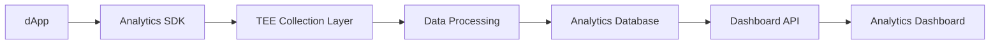

# NeoAnalytics - dApp Analytics Service

## 🎯 Overview

**NeoAnalytics** provides comprehensive analytics and insights for Neo dApps, offering real-time user behavior tracking, transaction analytics, performance monitoring, and business intelligence with privacy-preserving data collection through TEE protection.

## 🚀 Purpose

Understanding user behavior and application performance is crucial for dApp success. NeoAnalytics offers blockchain-native analytics that goes beyond traditional web analytics, providing insights into wallet interactions, transaction patterns, smart contract usage, and user engagement while respecting user privacy.

## ✨ Key Features

### **📊 Real-Time User Analytics**
- User session tracking and behavior analysis
- Wallet connection and authentication patterns
- Page views, events, and user journey mapping
- Cohort analysis and retention metrics

### **💰 Transaction Analytics**
- Transaction volume and value tracking
- Smart contract interaction analysis
- Gas usage optimization insights
- Revenue and payment flow analysis

### **⚡ Performance Monitoring**
- dApp loading times and performance metrics
- Blockchain interaction latency tracking
- Error rate monitoring and debugging
- Real-time performance alerts

### **🎯 Business Intelligence**
- Custom dashboards and reporting
- Conversion funnel analysis
- A/B testing framework
- Predictive analytics and forecasting

## 📊 Technical Specifications

### **Analytics Architecture**


### **Data Collection APIs**

#### **Event Tracking**
```http
POST /api/v1/events
Content-Type: application/json
Authorization: Bearer <api_key>

{
  "event_name": "wallet_connected",
  "user_id": "anonymous_hash",
  "wallet_address": "hashed_address",
  "timestamp": "2024-01-01T12:00:00Z",
  "properties": {
    "wallet_type": "neo_line",
    "connection_method": "direct",
    "user_agent": "Mozilla/5.0..."
  }
}
```

#### **Page Views**
```http
POST /api/v1/pageviews
Content-Type: application/json

{
  "page": "/marketplace",
  "title": "NFT Marketplace",
  "user_id": "anonymous_hash",
  "referrer": "https://google.com",
  "session_id": "session_hash"
}
```

#### **Transaction Tracking**
```http
POST /api/v1/transactions
Content-Type: application/json

{
  "transaction_hash": "0x123...",
  "user_id": "anonymous_hash",
  "action": "nft_purchase",
  "value": "100.00",
  "currency": "USDT",
  "gas_used": "0.5"
}
```

### **SDK Integration**

#### **JavaScript/TypeScript**
```typescript
import { NeoAnalytics } from '@r3e/neo-analytics';

// Initialize analytics
const analytics = new NeoAnalytics({
  apiKey: 'your-api-key',
  projectId: 'your-project-id',
  privacy: {
    anonymizeIPs: true,
    hashWalletAddresses: true,
    respectDoNotTrack: true
  }
});

// Track page views
analytics.page('Home', {
  category: 'navigation',
  path: '/'
});

// Track custom events
analytics.track('wallet_connected', {
  walletType: 'neo_line',
  connectionTime: Date.now()
});

// Track transactions
analytics.transaction({
  hash: txHash,
  action: 'token_swap',
  value: amount,
  currency: 'GAS'
});

// Set user properties
analytics.identify(userId, {
  wallet_type: 'neo_line',
  user_tier: 'premium',
  signup_date: '2024-01-01'
});
```

#### **React Integration**
```typescript
import { useNeoAnalytics } from '@r3e/neo-analytics-react';

function App() {
  const analytics = useNeoAnalytics();

  useEffect(() => {
    // Track app launch
    analytics.track('app_launched');
  }, []);

  const handleWalletConnect = (wallet: Wallet) => {
    analytics.track('wallet_connected', {
      walletType: wallet.type,
      address: wallet.address // automatically hashed
    });
  };

  return (
    <Router>
      <Routes>
        <Route path="/" element={<Home />} />
        <Route path="/marketplace" element={<Marketplace />} />
      </Routes>
    </Router>
  );
}

// Auto-tracking hook
function usePageTracking() {
  const analytics = useNeoAnalytics();
  const location = useLocation();

  useEffect(() => {
    analytics.page(location.pathname);
  }, [location, analytics]);
}
```

#### **Vue.js Integration**
```typescript
import { createNeoAnalytics } from '@r3e/neo-analytics-vue';

const app = createApp(App);

app.use(createNeoAnalytics({
  apiKey: process.env.VUE_APP_ANALYTICS_KEY,
  projectId: process.env.VUE_APP_PROJECT_ID
}));

// In components
export default {
  mounted() {
    this.$analytics.track('component_mounted', {
      component: 'UserProfile'
    });
  },
  
  methods: {
    async connectWallet() {
      const wallet = await this.walletService.connect();
      this.$analytics.track('wallet_connected', {
        walletType: wallet.type
      });
    }
  }
};
```

#### **Rust Backend Integration**
```rust
use neo_analytics::{AnalyticsClient, Event, TrackingConfig};

let analytics = AnalyticsClient::new(TrackingConfig {
    api_key: "your-api-key".to_string(),
    project_id: "your-project-id".to_string(),
    endpoint: "https://analytics.r3e.network".to_string(),
});

// Track server-side events
analytics.track(Event {
    name: "smart_contract_deployed".to_string(),
    user_id: Some(user_id.clone()),
    properties: json!({
        "contract_hash": contract_hash,
        "gas_consumed": gas_consumed,
        "deployment_time": Utc::now()
    }),
}).await?;
```

## 🔧 Analytics Features

### **User Behavior Analytics**
- **Session Analysis**: Session duration, bounce rate, page depth
- **User Journey**: Flow between pages and actions
- **Engagement Metrics**: Time on site, return visits, activity patterns
- **Cohort Analysis**: User retention over time

### **Blockchain-Specific Metrics**
- **Wallet Analytics**: Connection patterns, wallet type distribution
- **Transaction Metrics**: Volume, frequency, gas optimization
- **Smart Contract Usage**: Most used functions, execution patterns
- **Token Analytics**: Transfer patterns, holder distribution

### **Performance Insights**
- **Loading Performance**: Page load times, bundle size analysis
- **Blockchain Latency**: RPC response times, transaction confirmation delays
- **Error Tracking**: JavaScript errors, failed transactions
- **Availability Monitoring**: Uptime, service reliability

### **Business Intelligence**
- **Conversion Funnels**: User flow through key actions
- **Revenue Analytics**: Payment tracking, subscription metrics
- **A/B Testing**: Feature flag integration, experiment tracking
- **Predictive Models**: Churn prediction, user lifetime value

## 🔒 Privacy & Compliance

### **TEE-Protected Data Processing**
- All sensitive data processed within Intel SGX enclaves
- User data anonymization and hashing
- Cryptographic privacy guarantees
- Zero-knowledge analytics for sensitive metrics

### **Privacy Controls**
```typescript
const analytics = new NeoAnalytics({
  privacy: {
    anonymizeIPs: true,
    hashWalletAddresses: true,
    respectDoNotTrack: true,
    dataRetention: '2 years',
    allowCookies: false,
    localStorageOnly: true
  }
});
```

### **GDPR Compliance**
- User consent management
- Right to data deletion
- Data export capabilities
- Transparent data usage policies

## 📈 Dashboard & Reporting

### **Real-Time Dashboard**
- Live user activity monitoring
- Real-time transaction tracking
- Performance metrics visualization
- Custom alert notifications

### **Custom Reports**
```typescript
// Generate custom reports via API
const report = await analytics.generateReport({
  type: 'cohort_analysis',
  dateRange: {
    start: '2024-01-01',
    end: '2024-01-31'
  },
  metrics: ['retention', 'revenue', 'engagement'],
  groupBy: 'signup_week'
});
```

### **Automated Insights**
- Weekly performance summaries
- Anomaly detection alerts
- Growth trend notifications
- Optimization recommendations

## 💰 Pricing Structure

### **Starter** - Free
- Up to 10,000 events per month
- Basic dashboard and reports
- 30-day data retention
- Community support

### **Growth** - $49/month
- Up to 100,000 events per month
- Advanced analytics features
- 1-year data retention
- Email support
- Custom events and properties

### **Professional** - $149/month
- Up to 1,000,000 events per month
- Full feature access
- 3-year data retention
- Priority support
- Custom integrations
- A/B testing framework

### **Enterprise** - Custom
- Unlimited events
- Dedicated infrastructure
- Custom data retention
- 24/7 support
- White-label options
- On-premise deployment

## 🚀 Quick Start Guide

### **1. Create Project**
```bash
curl -X POST https://analytics.r3e.network/api/v1/projects \
  -H "Content-Type: application/json" \
  -d '{
    "name": "My Neo dApp",
    "domain": "mydapp.com",
    "type": "web"
  }'
```

### **2. Install SDK**
```bash
npm install @r3e/neo-analytics
# or
yarn add @r3e/neo-analytics
```

### **3. Initialize Tracking**
```typescript
import { NeoAnalytics } from '@r3e/neo-analytics';

const analytics = new NeoAnalytics({
  apiKey: process.env.REACT_APP_ANALYTICS_KEY,
  projectId: process.env.REACT_APP_PROJECT_ID
});

// Start tracking
analytics.init();
```

## 🔗 Integration Examples

### **E-commerce Analytics**
```typescript
class EcommerceTracking {
  private analytics: NeoAnalytics;

  constructor() {
    this.analytics = new NeoAnalytics({
      apiKey: process.env.ANALYTICS_KEY
    });
  }

  trackProductView(product: Product) {
    this.analytics.track('product_viewed', {
      product_id: product.id,
      product_name: product.name,
      category: product.category,
      price: product.price,
      currency: product.currency
    });
  }

  trackPurchase(order: Order) {
    this.analytics.track('purchase_completed', {
      order_id: order.id,
      total_value: order.total,
      currency: order.currency,
      item_count: order.items.length,
      payment_method: order.payment_method
    });

    // Track individual items
    order.items.forEach(item => {
      this.analytics.track('item_purchased', {
        product_id: item.product_id,
        quantity: item.quantity,
        price: item.price
      });
    });
  }

  trackCartAction(action: string, product: Product) {
    this.analytics.track(`cart_${action}`, {
      product_id: product.id,
      cart_size: this.getCartSize(),
      cart_value: this.getCartValue()
    });
  }
}
```

### **Gaming dApp Analytics**
```typescript
class GameAnalytics {
  private analytics: NeoAnalytics;

  constructor() {
    this.analytics = new NeoAnalytics({
      apiKey: process.env.ANALYTICS_KEY
    });
  }

  trackGameSession(session: GameSession) {
    this.analytics.track('game_session_started', {
      game_mode: session.mode,
      level: session.level,
      character: session.character
    });
  }

  trackLevelComplete(level: number, score: number, duration: number) {
    this.analytics.track('level_completed', {
      level: level,
      score: score,
      duration_seconds: duration,
      performance: this.calculatePerformance(score, duration)
    });
  }

  trackNFTInteraction(action: string, nft: GameNFT) {
    this.analytics.track(`nft_${action}`, {
      nft_id: nft.id,
      nft_type: nft.type,
      rarity: nft.rarity,
      value: nft.current_value
    });
  }
}
```

### **DeFi Protocol Analytics**
```typescript
class DeFiAnalytics {
  private analytics: NeoAnalytics;

  constructor() {
    this.analytics = new NeoAnalytics({
      apiKey: process.env.ANALYTICS_KEY
    });
  }

  trackLiquidityAction(action: string, pool: LiquidityPool, amount: string) {
    this.analytics.track(`liquidity_${action}`, {
      pool_id: pool.id,
      token_pair: `${pool.token0}/${pool.token1}`,
      amount: amount,
      pool_tvl: pool.totalValueLocked,
      apy: pool.currentAPY
    });
  }

  trackSwap(swap: SwapTransaction) {
    this.analytics.track('token_swap', {
      from_token: swap.tokenIn,
      to_token: swap.tokenOut,
      amount_in: swap.amountIn,
      amount_out: swap.amountOut,
      slippage: swap.slippage,
      gas_used: swap.gasUsed
    });
  }

  trackYieldFarm(action: string, farm: YieldFarm) {
    this.analytics.track(`yield_${action}`, {
      farm_id: farm.id,
      reward_token: farm.rewardToken,
      staked_amount: farm.userStaked,
      pending_rewards: farm.pendingRewards,
      apy: farm.currentAPY
    });
  }
}
```

## 📊 Advanced Analytics Features

### **Funnel Analysis**
```typescript
// Define conversion funnel
const funnel = await analytics.createFunnel({
  name: 'User Onboarding',
  steps: [
    { event: 'landing_page_view', name: 'Landing' },
    { event: 'wallet_connected', name: 'Wallet Connected' },
    { event: 'profile_created', name: 'Profile Created' },
    { event: 'first_transaction', name: 'First Purchase' }
  ],
  timeWindow: '7 days'
});

const funnelData = await analytics.getFunnelData(funnel.id);
```

### **Cohort Analysis**
```typescript
// Analyze user retention cohorts
const cohortAnalysis = await analytics.getCohortAnalysis({
  metric: 'retention',
  period: 'weekly',
  cohortType: 'registration_date',
  dateRange: {
    start: '2024-01-01',
    end: '2024-03-31'
  }
});
```

### **A/B Testing**
```typescript
// Set up A/B test
const experiment = await analytics.createExperiment({
  name: 'New Checkout Flow',
  variants: [
    { name: 'control', weight: 50 },
    { name: 'new_flow', weight: 50 }
  ],
  metrics: ['conversion_rate', 'average_order_value']
});

// In your app
const variant = analytics.getExperimentVariant('checkout_flow');
if (variant === 'new_flow') {
  // Show new checkout flow
}
```

## 🔍 Troubleshooting

### **Common Integration Issues**

#### **Events Not Appearing**
```typescript
// Ensure proper initialization
analytics.init().then(() => {
  analytics.track('app_ready');
});

// Check network connectivity
analytics.on('error', (error) => {
  console.error('Analytics error:', error);
});
```

#### **Performance Impact**
```typescript
// Use buffered tracking for better performance
const analytics = new NeoAnalytics({
  apiKey: 'your-key',
  batching: {
    enabled: true,
    batchSize: 50,
    flushInterval: 10000 // 10 seconds
  }
});
```

## 📞 Support & Resources

- **Documentation**: [docs.neoanalytics.r3e.network](https://docs.neoanalytics.r3e.network)
- **Dashboard**: [analytics.r3e.network](https://analytics.r3e.network)
- **API Reference**: [api.neoanalytics.r3e.network](https://api.neoanalytics.r3e.network)
- **SDK Examples**: [github.com/r3e-network/neo-analytics-examples](https://github.com/r3e-network/neo-analytics-examples)
- **Discord Support**: [discord.gg/r3e-network](https://discord.gg/r3e-network)
- **Email**: [analytics@r3e.network](mailto:analytics@r3e.network)

---

**NeoAnalytics empowers dApp developers with comprehensive insights into user behavior, transaction patterns, and application performance while maintaining the highest privacy standards through TEE-protected data processing.** 