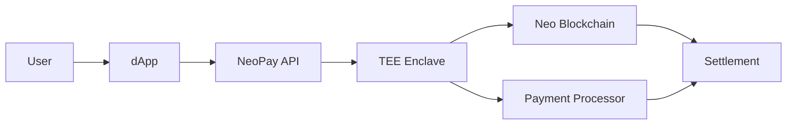

# NeoPay - Payment Processing Service

## 🎯 Overview

**NeoPay** is a comprehensive payment processing platform for Neo dApps, providing seamless integration for multi-token payments, fiat on/off ramps, subscription billing, and escrow services with enterprise-grade security through TEE protection.

## 🚀 Purpose

Modern dApps need flexible payment solutions that handle both cryptocurrency and traditional payments. NeoPay simplifies payment integration by providing a unified API that supports multiple tokens, automatic currency conversion, subscription management, and secure escrow functionality.

## ✨ Key Features

### **💳 Multi-Token Payment Processing**
- Support for all NEP-17 tokens (GAS, NEO, USDT, etc.)
- Automatic currency conversion and routing
- Real-time exchange rate optimization
- Payment splitting and multi-recipient support

### **🏦 Fiat On/Off Ramps**
- Credit card and bank transfer integration
- Global payment method support (50+ countries)
- KYC/AML compliance automation
- Instant fiat-to-crypto conversion

### **🔄 Subscription Billing Automation**
- Recurring payment management
- Flexible billing cycles (daily, weekly, monthly, yearly)
- Usage-based billing and metered pricing
- Dunning management for failed payments

### **🔒 Secure Escrow Services**
- TEE-protected escrow smart contracts
- Milestone-based payment release
- Dispute resolution mechanisms
- Multi-signature approval workflows

## 📊 Technical Specifications

### **Payment Flow Architecture**


### **API Endpoints**

#### **Create Payment Intent**
```http
POST /api/v1/payments/intent
Content-Type: application/json
Authorization: Bearer <api_key>

{
  "amount": "100.00",
  "currency": "USDT",
  "destination_currency": "GAS",
  "recipient": "NXXzKhzgs8EQtpNrNdvLfPjBQU3Cq3Kt1i",
  "description": "Premium subscription payment",
  "metadata": {
    "subscription_id": "sub_123",
    "user_id": "user_456"
  }
}
```

#### **Process Payment**
```http
POST /api/v1/payments/{payment_id}/confirm
Content-Type: application/json

{
  "payment_method": "wallet",
  "wallet_signature": "signed_transaction_data",
  "sender_address": "NXXzKhzgs8EQtpNrNdvLfPjBQU3Cq3Kt1i"
}
```

#### **Create Subscription**
```http
POST /api/v1/subscriptions
Content-Type: application/json

{
  "customer_id": "customer_123",
  "price_id": "price_456",
  "billing_cycle": "monthly",
  "start_date": "2024-01-01T00:00:00Z",
  "payment_method": "wallet_auto"
}
```

### **SDK Integration**

#### **JavaScript/TypeScript**
```typescript
import { NeoPay } from '@r3e/neo-pay';

// Initialize payment processor
const neoPay = new NeoPay({
  apiKey: 'your-api-key',
  environment: 'production', // or 'sandbox'
  appId: 'your-app-id'
});

// Create payment intent
const paymentIntent = await neoPay.createPayment({
  amount: '50.00',
  currency: 'USDT',
  recipient: recipientAddress,
  description: 'Premium feature unlock'
});

// Handle payment confirmation
const payment = await neoPay.confirmPayment(paymentIntent.id, {
  paymentMethod: 'wallet',
  signature: walletSignature
});

// Set up subscription
const subscription = await neoPay.createSubscription({
  customerId: userId,
  priceId: 'premium_monthly',
  paymentMethod: 'auto_wallet'
});
```

#### **React Hook**
```typescript
import { useNeoPay } from '@r3e/neo-pay-react';

function PaymentComponent() {
  const { createPayment, isLoading, error } = useNeoPay();

  const handlePayment = async () => {
    try {
      const payment = await createPayment({
        amount: '25.00',
        currency: 'GAS',
        description: 'Digital asset purchase'
      });
      
      // Payment successful
      console.log('Payment completed:', payment);
    } catch (err) {
      console.error('Payment failed:', err);
    }
  };

  return (
    <button onClick={handlePayment} disabled={isLoading}>
      {isLoading ? 'Processing...' : 'Pay 25 GAS'}
    </button>
  );
}
```

#### **Rust**
```rust
use neo_pay::{NeoPayClient, PaymentRequest, Currency};

let client = NeoPayClient::new("your-api-key", Environment::Production);

let payment_request = PaymentRequest {
    amount: "100.00".to_string(),
    currency: Currency::USDT,
    recipient: "NXXzKhzgs8EQtpNrNdvLfPjBQU3Cq3Kt1i".to_string(),
    description: "Service payment".to_string(),
    metadata: HashMap::new(),
};

let payment_intent = client.create_payment(payment_request).await?;
```

## 🔧 Supported Payment Methods

### **Cryptocurrency Payments**
- **Neo Native**: NEO, GAS
- **NEP-17 Tokens**: USDT, USDC, DAI, and custom tokens
- **Cross-Chain**: Bitcoin, Ethereum (via bridges)
- **Stablecoins**: Multi-chain stablecoin support

### **Fiat Payment Methods**
- **Credit/Debit Cards**: Visa, Mastercard, American Express
- **Bank Transfers**: SEPA, ACH, Wire transfers
- **Digital Wallets**: PayPal, Apple Pay, Google Pay
- **Regional Methods**: Alipay, WeChat Pay, UPI, PIX

### **Alternative Methods**
- **Buy Now, Pay Later**: Klarna, Afterpay integration
- **Cryptocurrency Earn**: DeFi yield integration
- **Gift Cards**: Digital gift card acceptance
- **Corporate Cards**: B2B payment solutions

## 🔒 Security & Compliance

### **TEE Protection**
- Payment processing within Intel SGX enclaves
- Private key management in secure hardware
- Tamper-proof transaction signing
- Cryptographic payment verification

### **Regulatory Compliance**
- **PCI DSS Level 1** certification
- **SOC 2 Type II** compliance
- **GDPR** data protection compliance
- **AML/KYC** automated screening

### **Security Features**
- End-to-end encryption
- Real-time fraud detection
- 3D Secure authentication
- Multi-factor authorization

## 💰 Pricing Structure

### **Transaction Fees**
- **Cryptocurrency**: 0.5% per transaction
- **Fiat Payments**: 2.9% + $0.30 per transaction
- **Subscriptions**: 0.8% per recurring payment
- **Cross-border**: Additional 1.5% for international transactions

### **Monthly Plans**

#### **Starter** - Free
- Up to $1,000 monthly volume
- Basic payment methods
- Standard API access
- Community support

#### **Growth** - $29/month
- Up to $50,000 monthly volume
- All payment methods
- Advanced APIs
- Email support
- Custom branding

#### **Scale** - $149/month
- Up to $500,000 monthly volume
- Priority processing
- Dedicated support
- Custom integrations
- Advanced analytics

#### **Enterprise** - Custom
- Unlimited volume
- Custom fee structures
- Dedicated infrastructure
- 24/7 phone support
- SLA guarantees

## 🚀 Quick Start Guide

### **1. Account Setup**
```bash
# Register for NeoPay account
curl -X POST https://neopay.r3e.network/api/v1/register \
  -H "Content-Type: application/json" \
  -d '{
    "business_name": "My Neo dApp",
    "email": "developer@mydapp.com",
    "website": "https://mydapp.com"
  }'
```

### **2. Install SDK**
```bash
# npm/yarn
npm install @r3e/neo-pay
# or
yarn add @r3e/neo-pay

# Rust
cargo add neo-pay
```

### **3. Initialize Client**
```typescript
import { NeoPay } from '@r3e/neo-pay';

const neoPay = new NeoPay({
  apiKey: process.env.NEOPAY_API_KEY,
  environment: 'production'
});
```

### **4. Process First Payment**
```typescript
// Create payment intent
const payment = await neoPay.createPayment({
  amount: '10.00',
  currency: 'USDT',
  description: 'Test payment'
});

// Redirect user to payment page
window.location.href = payment.payment_url;
```

## 🔗 Integration Examples

### **E-commerce Checkout**
```typescript
import { NeoPay } from '@r3e/neo-pay';

class CheckoutService {
  private neoPay: NeoPay;

  constructor() {
    this.neoPay = new NeoPay({
      apiKey: process.env.NEOPAY_API_KEY
    });
  }

  async processOrder(order: Order) {
    // Create payment for order total
    const payment = await this.neoPay.createPayment({
      amount: order.total.toString(),
      currency: order.currency,
      recipient: process.env.MERCHANT_WALLET,
      description: `Order #${order.id}`,
      metadata: {
        order_id: order.id,
        customer_id: order.customer_id
      }
    });

    return payment;
  }

  async handlePaymentSuccess(paymentId: string) {
    const payment = await this.neoPay.getPayment(paymentId);
    
    if (payment.status === 'completed') {
      // Fulfill order
      await this.fulfillOrder(payment.metadata.order_id);
    }
  }
}
```

### **Subscription Service**
```typescript
class SubscriptionManager {
  private neoPay: NeoPay;

  constructor() {
    this.neoPay = new NeoPay({
      apiKey: process.env.NEOPAY_API_KEY
    });
  }

  async createPremiumSubscription(userId: string) {
    const subscription = await this.neoPay.createSubscription({
      customerId: userId,
      priceId: 'premium_monthly_1000_gas',
      billingCycle: 'monthly',
      trialPeriodDays: 7
    });

    return subscription;
  }

  async handleSubscriptionEvent(event: SubscriptionEvent) {
    switch (event.type) {
      case 'subscription.payment_succeeded':
        await this.extendUserAccess(event.subscription.customer_id);
        break;
      case 'subscription.payment_failed':
        await this.notifyPaymentFailure(event.subscription.customer_id);
        break;
      case 'subscription.cancelled':
        await this.revokeUserAccess(event.subscription.customer_id);
        break;
    }
  }
}
```

### **Marketplace Escrow**
```typescript
class MarketplaceEscrow {
  private neoPay: NeoPay;

  constructor() {
    this.neoPay = new NeoPay({
      apiKey: process.env.NEOPAY_API_KEY
    });
  }

  async createEscrowPayment(tradeId: string, amount: string, buyer: string, seller: string) {
    const escrow = await this.neoPay.createEscrow({
      amount: amount,
      currency: 'USDT',
      buyer: buyer,
      seller: seller,
      releaseConditions: {
        type: 'milestone',
        milestones: [
          { description: 'Item shipped', percentage: 50 },
          { description: 'Item delivered', percentage: 50 }
        ]
      },
      timeout: '7 days'
    });

    return escrow;
  }

  async releaseFunds(escrowId: string, milestone: string) {
    await this.neoPay.releaseEscrow(escrowId, {
      milestone: milestone,
      signature: await this.getAuthorizedSignature()
    });
  }
}
```

## 📊 Analytics & Reporting

### **Payment Analytics**
- Transaction volume and trends
- Payment method performance
- Conversion rate optimization
- Revenue forecasting

### **Customer Insights**
- Payment behavior analysis
- Subscription churn prediction
- Customer lifetime value
- Geographic payment patterns

### **Real-time Monitoring**
- Payment success rates
- Processing latency metrics
- Error rate monitoring
- Fraud detection alerts

## 🛠️ Advanced Features

### **Dynamic Pricing**
```typescript
// Set up dynamic pricing based on demand
const dynamicPrice = await neoPay.calculateDynamicPrice({
  basePrice: '100.00',
  currency: 'USDT',
  factors: {
    demand: 'high',
    timeOfDay: 'peak',
    userTier: 'premium'
  }
});
```

### **Smart Routing**
```typescript
// Optimize payment routing for best rates
const routedPayment = await neoPay.createOptimizedPayment({
  amount: '500.00',
  fromCurrency: 'USD',
  toCurrency: 'GAS',
  optimizeFor: 'lowest_cost' // or 'fastest', 'most_reliable'
});
```

### **Webhook Integration**
```typescript
// Handle payment webhooks
app.post('/webhooks/neopay', async (req, res) => {
  const event = neoPay.verifyWebhook(req.body, req.headers['neo-signature']);
  
  switch (event.type) {
    case 'payment.succeeded':
      await handlePaymentSuccess(event.data);
      break;
    case 'payment.failed':
      await handlePaymentFailure(event.data);
      break;
  }
  
  res.status(200).send('OK');
});
```

## 🔍 Troubleshooting

### **Common Issues**

#### **Payment Failures**
```typescript
// Implement retry logic for failed payments
const retryPayment = async (paymentId: string) => {
  const payment = await neoPay.getPayment(paymentId);
  
  if (payment.status === 'failed') {
    return await neoPay.retryPayment(paymentId);
  }
};
```

#### **Rate Limiting**
```typescript
// Handle rate limiting gracefully
const handleRateLimit = async (operation: () => Promise<any>) => {
  try {
    return await operation();
  } catch (error) {
    if (error.code === 'RATE_LIMIT_EXCEEDED') {
      await new Promise(resolve => setTimeout(resolve, 1000));
      return await operation();
    }
    throw error;
  }
};
```

## 📞 Support & Resources

- **Documentation**: [docs.neopay.r3e.network](https://docs.neopay.r3e.network)
- **API Reference**: [api.neopay.r3e.network](https://api.neopay.r3e.network)
- **SDK Examples**: [github.com/r3e-network/neo-pay-examples](https://github.com/r3e-network/neo-pay-examples)
- **Status Page**: [status.neopay.r3e.network](https://status.neopay.r3e.network)
- **Discord Support**: [discord.gg/r3e-network](https://discord.gg/r3e-network)
- **Email**: [payments@r3e.network](mailto:payments@r3e.network)

---

**NeoPay revolutionizes dApp monetization by providing comprehensive payment infrastructure that handles everything from simple transactions to complex subscription billing and escrow services, all secured by TEE technology.** 